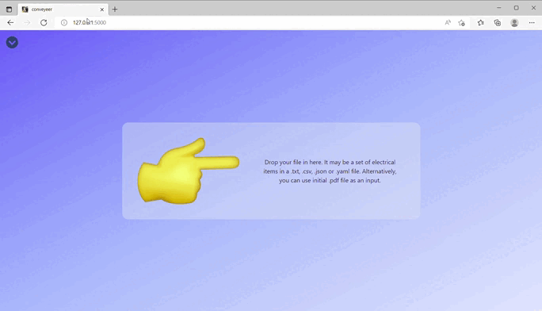
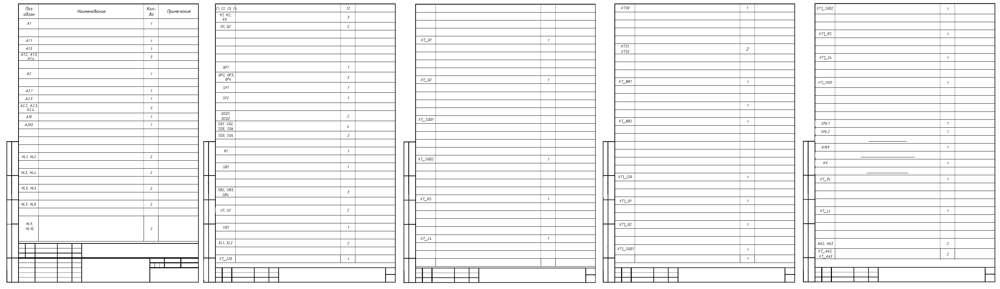
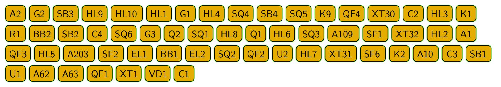

# Idea

Electrical equipment, according to industry standards, must have all of its internal components marked with special stickers that map components to their appearance in electrical documentation i. e. circuit diagram, list of electrical components.

This package serves the purpose of automatically generating PDF document with marking stickers for given list of electrical components presented in standartized .pdf file or in .txt, .csv, .json or .yaml format. Generated document can be printed on specialized equipment.


# Notes

- No registration/authentication required. Works like an online converter;
- Under the hood uses custom utilities: [pictor](./pictor/README.md), [lector](./lector/README.md);
- Input in .txt/.csv/.json/.yaml is prefered over .pdf because pdf parsing is dependent on document formatting, naming conventions etc. and therefore is error prone.

# Tech stack & dependencies

- [Python](https://www.python.org/) 3.8.10;
- [Flask](https://flask.palletsprojects.com/en/2.1.x/) 2.1;
- [Celery](https://docs.celeryq.dev/en/stable/) 5.2.6
- [Redis](https://redis.io/) 7.0.0;
- [Tailwindcss](https://tailwindcss.com/) 3.0.24;
- [HTMX](https://htmx.org/) 1.7.0;
- [Hyperscript](https://hyperscript.org/) 0.9.5.

... along with PDF processing tools:

- [PyX](https://pyx-project.org/index.html) 0.15;
- [PyPDF2](https://pypi.org/project/PyPDF2/) 1.28.2;
- [slate3k](https://pypi.org/project/slate3k/) 0.5.3.

The full list of dependencies is in requirements.txt.

# Typical workflow

Client-server interaction in main usecase would like this from the perspective of HTTP request-response cycles.


# Demonstration #1

Here, a .csv file with the following content was dropped into the input window:

```
A1, A2, A3, A4, A5, A6, A7, A8, A9, A10, A11, A12, A13, A14, A15
C1, C2, C3, C4, C5, C6, C7, C8, C9, C10
EK1, EK2, EK3, EK4, EK5, EK6
HL1, HL2, HL3, HL4, HL5, HL6, HL7
L1, L2, L3, L4, L5, L6, L7, L8, L9
K1, K2, K3, K4, K5, K6, K7, K8, K9, K10
QF1, QF2, QF3, QF4, QF5, QF6, QF7, QF8, QF9, QF10, QF11, QF12, QF13, QF14, QF15
SF1, SF2, SF3, SF4, SF5, SF6, SF7, SF8, SF9, SF10, SF11, SF12, SF13, SF14, SF15
T1, T2, T3, T4, T5, T6, T7, T8
U1, U2, U3, U4, U5, U6
XT1, XT2, XT3, XT4, XT5, XT6, XT7, XT8, XT9, XT10, XT11, XT12, XT13, XT14, XT15, XT16, XT17, XT18, XT19, XT20, XT21, XT22, XT23, XT24, XT25, XT26, XT27, XT28, XT29, XT30
R1, R2, R3, R4, R5, R6, R7, R8, R9, R10, R11, R12
RU1, RU2, RU3, RU4, RU5, RU6, RU7, RU8, RU9, RU10
XP1, XP2, XP3, XP4, XP5, XP6, XP7, XP8, XP9, XP10, XP11, XP12, XP13, XP14, XP15, XP16, XP17, XP18
XS1, XS2, XS3, XS4, XS5, XS6, XS7, XS8, XS9, XS10, XS11, XS12, XS13, XS14, XS15
```



# Demonstration #2

In this example, the .pdf file shown below was fed into the input window. In this case only 'Designation' column matters becaues it contains items` denotations which are to be printed. In the example everything else is blank.



Recieved output:



# What is not yet implemented, but should be

- Implement tweaking drawing and cropping settings. Used utilities allow for it, but currently web app has no way of accessing those settings;
- PDF parser module probably needs more work - now parsing success is highly dependent on pdf`s author pedantry;
- Describe web app deployment and launch in the readme.
