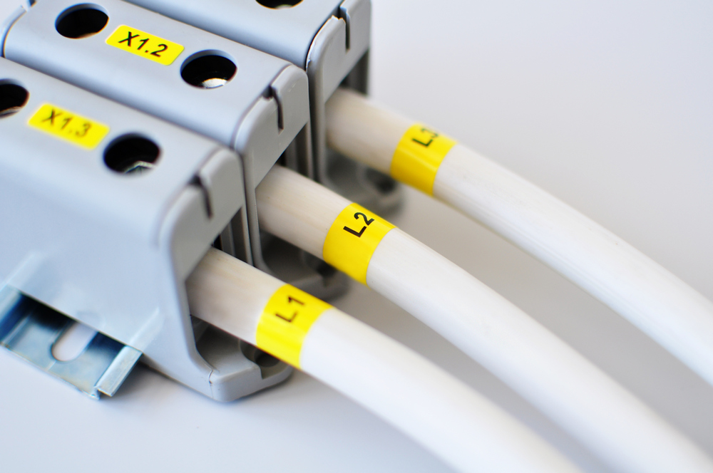
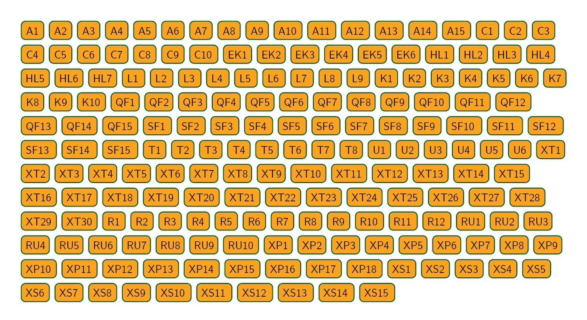

# Main purpose

This package deliveres a utility that can generate marking of electrical items/components.



# Notes

- Cutting lines can be included in generated document so that specialized printing machinery can laser-cut printed marking items;
- Aside from native Python iterables module accepts `.txt`, `.csv`, `.json`, `.yaml` input (see `convert.py` module);
- Drawing settings are configured via modifying `pictorConfig.DeafultConfig` instance before feeding it into `pictor.draw_marking()`.

# Example

Given the input below...

```
A1, A2, A3, A4, A5, A6, A7, A8, A9, A10, A11, A12, A13, A14, A15
C1, C2, C3, C4, C5, C6, C7, C8, C9, C10
EK1, EK2, EK3, EK4, EK5, EK6
HL1, HL2, HL3, HL4, HL5, HL6, HL7
L1, L2, L3, L4, L5, L6, L7, L8, L9
K1, K2, K3, K4, K5, K6, K7, K8, K9, K10
QF1, QF2, QF3, QF4, QF5, QF6, QF7, QF8, QF9, QF10, QF11, QF12, QF13, QF14, QF15
SF1, SF2, SF3, SF4, SF5, SF6, SF7, SF8, SF9, SF10, SF11, SF12, SF13, SF14, SF15
T1, T2, T3, T4, T5, T6, T7, T8
U1, U2, U3, U4, U5, U6
XT1, XT2, XT3, XT4, XT5, XT6, XT7, XT8, XT9, XT10, XT11, XT12, XT13, XT14, XT15, XT16, XT17, XT18, XT19, XT20, XT21, XT22, XT23, XT24, XT25, XT26, XT27, XT28, XT29, XT30
R1, R2, R3, R4, R5, R6, R7, R8, R9, R10, R11, R12
RU1, RU2, RU3, RU4, RU5, RU6, RU7, RU8, RU9, RU10
XP1, XP2, XP3, XP4, XP5, XP6, XP7, XP8, XP9, XP10, XP11, XP12, XP13, XP14, XP15, XP16, XP17, XP18
XS1, XS2, XS3, XS4, XS5, XS6, XS7, XS8, XS9, XS10, XS11, XS12, XS13, XS14, XS15
```

Module produces such output:



# Installation

    $ clone git repo
    $ pip install -r requirements.txt
    $ sudo ./font_setup.sh

# Usage

See input and output examples, as well as usage example in `./example` .

```python
import pictor
import pictorConfig
import convert


list_of_electrical_items = convert.txt2list('sample_input.txt')

drawing_config = pictorConfig.DeafultConfig()
drawing_config.HORIZONTAL_GAP_BETWEEN_MARKING_ITEMS_IN_MM = 4
drawing_config.VERTICAL_GAP_BETWEEN_MARKING_ITEMS_IN_MM = 4

pictor.draw_marking(
    items=list_of_electrical_items,
    output_file_name=r'sample_output',
    config=drawing_config,
    with_cutting_lines=True,
)
```

# To do

- Implement font colour selection (now it is only black);
- Implement just drawing rounded rectangle without text (may be useful);
- Add enumerations of possible colours, fonts etc. in the readme;
- Complete installation guide in the readme.
